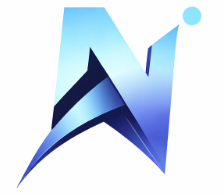

<div align="center">



# NEXORA AI

### The Smartest Way to Hire Top Interns

**AI-Powered Internship Performance Intelligence Platform**

[](https://nexora-ai-frontend.onrender.com)
[](https://react.dev)
[](https://nodejs.org)
[](https://mongodb.com)
[](https://tailwindcss.com)
[](https://groq.com)

---

> *"NexoraAI completely transformed how we identify top talent. The HireIndex™ is frighteningly accurate."*
> — **Abhinay Gowda**, Founder @ Nexora

</div>

---

## 🌐 Live Deployment

| Service | URL |
|---------|-----|
| **Frontend** | [https://nexora-ai-frontend.onrender.com](https://nexora-ai-frontend.onrender.com) |
| **Platform** | Render (Static Site + Web Service) |

---

## What is NexoraAI?

NexoraAI is an **enterprise-grade, AI-powered internship performance analyzer** built to solve one of tech's most expensive blind spots — companies losing great interns because they lack the data to evaluate them properly.

Our platform combines a **proprietary HireIndex™ prediction engine**, a **real-time AI coaching system** powered by Groq's Llama 3.1, and a **role-based analytics workspace** that gives Interns, Mentors, and Admins exactly what they need to make better decisions, faster.

---

## Core Features

### HireIndex™ — AI Hiring Oracle
Our flagship proprietary engine analyses hundreds of performance signals across engineering readiness, task completion velocity, mentor feedback, and growth trajectory to produce a single, highly accurate **hire-conversion probability score**. No guesswork. Pure data.

- Predicts full-time conversion likelihood
- Surfaces gap analysis per intern
- Powers the real-time leaderboard
- Produces exportable hiring reports

### AI Performance Coach
Integrated **Groq API (Llama 3.1)** delivers on-demand, personalised coaching feedback to every intern — at scale, in real time. No waiting for weekly 1:1s.

- Context-aware feedback on submitted tasks
- Performance pattern recognition
- Actionable improvement suggestions
- Auto-generated weekly summaries

### Role-Based Intelligence Dashboards
Three purpose-built workspaces — because Interns, Mentors, and Admins have fundamentally different needs.

| Role | Capabilities |
|------|-------------|
| **Intern** | Task tracker, AI Coach, HireIndex score, Leaderboard, Learning Hub |
| **Mentor** | Submission review, feedback tools, intern progress analytics |
| **Admin** | Hiring analytics, HireIndex™ overview, resource management, export |

### Smart Task Management
Structured task assignment with deadline tracking, submission workflows, mentor review pipelines, and completion analytics — all linked directly into the HireIndex™ scoring engine.

### Leaderboard & Gamification
Real-time performance ranking that keeps interns motivated and gives admins an instant top-of-funnel view of hire-ready talent.

### Data Export Engine
One-click **PDF and CSV export** of performance reports, hiring analytics, and intern scorecards — ready for HR systems, board reviews, and compliance audits.

---

## Technology Stack

### Frontend
| Technology | Purpose |
|-----------|---------|
| **React 19** | UI library with concurrent features |
| **Vite 7** | Lightning-fast build tooling |
| **Tailwind CSS 3** | Utility-first styling |
| **Recharts** | Data visualisation & analytics charts |
| **Lucide React** | Icon system |
| **Canvas API** | Custom 3D hero animations (no Three.js) |
| **React Router 7** | Client-side routing |
| **Axios** | HTTP client |

### Backend
| Technology | Purpose |
|-----------|---------|
| **Node.js + Express 5** | REST API server |
| **MongoDB + Mongoose** | Primary database & ODM |
| **JWT + bcryptjs** | Authentication & password security |
| **Groq API (Llama 3.1)** | AI coaching engine |
| **OpenAI SDK** | Supplementary AI features |
| **Nodemailer** | Email notifications |
| **node-cron** | Scheduled background jobs |
| **PDFKit + json2csv** | Report generation & export |

---

## Project Structure

```
NexoraAI/
│
├── frontend/                        # React + Vite SPA
│   ├── public/
│   │   ├── nexoralogo.png
│   │   └── images/                  # Hero, about, auth images
│   └── src/
│       ├── api.js                   # Centralised API config
│       ├── App.jsx                  # Routes & providers
│       ├── context/
│       │   └── AuthContext.jsx      # JWT auth state
│       ├── components/
│       │   ├── HeroScene.jsx        # Full-page 3D canvas animation
│       │   ├── NeuralNetworkCanvas.jsx
│       │   ├── CareerCanvas.jsx
│       │   ├── MainLayout.jsx
│       │   ├── ProtectedRoute.jsx
│       │   └── VideoModal.jsx
│       └── pages/
│           ├── LandingPage.jsx      # Premium 3D landing page
│           ├── Login.jsx            # Auth — neural network panel
│           ├── Register.jsx         # Auth — career canvas panel
│           ├── Dashboard/           # Role-based dashboards
│           ├── HireIndexPage.jsx
│           ├── LeaderboardPage.jsx
│           ├── AICoachPage.jsx
│           ├── LearningHubPage.jsx
│           ├── InternTasksPage.jsx
│           ├── MentorReviewPage.jsx
│           └── admin/
│               └── HiringAnalyticsPage.jsx
│
└── backend/                         # Node.js + Express API
    ├── server.js                    # Entry point
    └── src/
        ├── config/
        │   └── db.js                # MongoDB connection
        ├── middleware/
        │   ├── authMiddleware.js
        │   └── errorMiddleware.js
        ├── utils/
        └── modules/                 # Feature-based architecture
            ├── auth/
            ├── users/
            ├── tasks/
            ├── performance/
            ├── hireIndex/           # HireIndex™ engine
            ├── aiCoach/             # Groq AI integration
            ├── leaderboard/
            ├── learningHub/
            ├── hiringAnalytics/
            ├── activity/
            ├── export/              # PDF + CSV generation
            └── notifications/       # Email service
```

---

## Local Development

### Prerequisites
- Node.js 18+
- MongoDB (local or Atlas)
- Groq API key — [console.groq.com](https://console.groq.com)

### 1. Clone the repository

```bash
git clone https://github.com/Abhinay-12-k/NEXORA.AI.git
cd NEXORA.AI
```

### 2. Backend setup

```bash
cd backend
npm install
```

Create `backend/.env`:

```env
PORT=5000
MONGO_URI=mongodb://localhost:27017/nexoraai
JWT_SECRET=your_super_secret_jwt_key_here
GROQ_API_KEY=your_groq_api_key_here
EMAIL_USER=your_email@gmail.com
EMAIL_PASS=your_app_password
```

```bash
npm run dev
```

Backend runs on `http://localhost:5000`

### 3. Frontend setup

```bash
cd frontend
npm install
```

Create `frontend/.env`:

```env
VITE_API_URL=http://localhost:5000/api
```

```bash
npm run dev
```

Frontend runs on `http://localhost:5173`

---

## Deployment (Render)

### Backend — Web Service

| Setting | Value |
|---------|-------|
| **Environment** | Node |
| **Build Command** | `cd backend && npm install` |
| **Start Command** | `cd backend && npm start` |

**Environment Variables:**
```
PORT            = 5000
MONGO_URI       = mongodb+srv://...
JWT_SECRET      = <strong-secret>
GROQ_API_KEY    = <groq-key>
```

### Frontend — Static Site

| Setting | Value |
|---------|-------|
| **Build Command** | `cd frontend && npm install && npm run build` |
| **Publish Directory** | `frontend/dist` |

**Environment Variables:**
```
VITE_API_URL = https://your-backend.onrender.com/api
```

---

## User Roles

```
Register as:

  INTERN  →  Access personal dashboard, AI Coach, tasks, leaderboard
  MENTOR  →  Review submissions, provide feedback, track assigned interns
  ADMIN   →  Full platform access, hiring analytics, HireIndex™ overview
```

---

## Security

- JWT-based stateless authentication with role-based route protection
- Password hashing with bcryptjs (salt rounds: 12)
- Environment-based secrets — zero credentials in source code
- CORS configured per environment (dev / production)
- Protected routes enforced on both client and server
- Input validation at all API boundaries

---

## Screenshots

| Landing Page | Dashboard | HireIndex™ |
|---|---|---|
| Full-page 3D neural sphere hero | Role-based analytics workspace | AI-powered hire prediction gauge |

---

## Roadmap

- [ ] Multi-organisation support (SaaS tenancy)
- [ ] Slack & Teams integration for AI Coach notifications
- [ ] Custom HireIndex™ weighting per organisation
- [ ] Mobile app (React Native)
- [ ] Interview scheduling & feedback loop
- [ ] GitHub activity correlation in HireIndex™ scoring

---

## Author

**Abhinay Gowda**
- GitHub: [@Abhinay-12-k](https://github.com/Abhinay-12-k)
- Project: [github.com/Abhinay-12-k/NEXORA.AI](https://github.com/Abhinay-12-k/NEXORA.AI)
- Live: [nexora-ai-frontend.onrender.com](https://nexora-ai-frontend.onrender.com)

---

<div align="center">

**Built with precision. Powered by AI. Designed to hire smarter.**

*© 2026 NexoraAI — by Abhinay Gowda*

</div>
